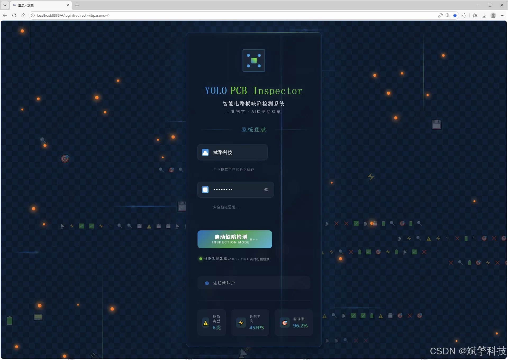
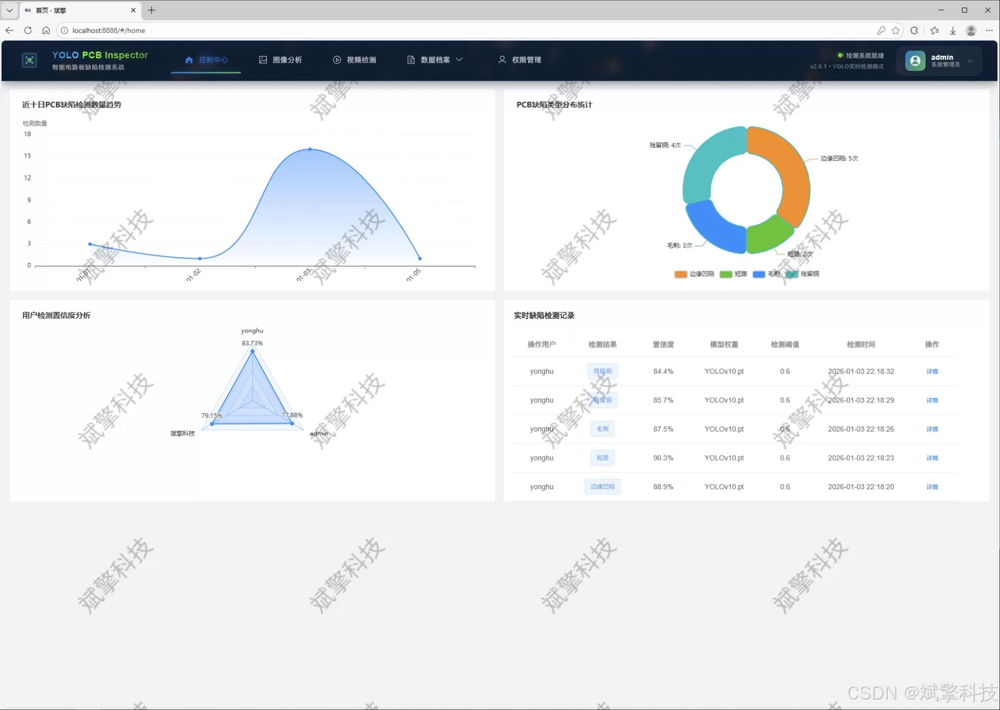
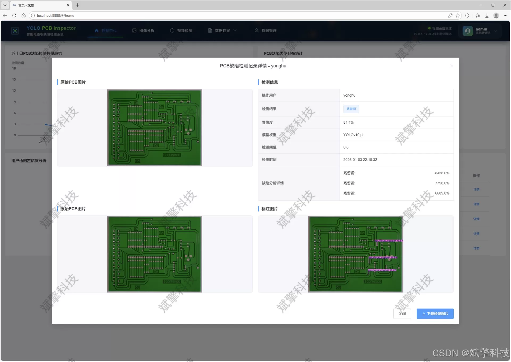
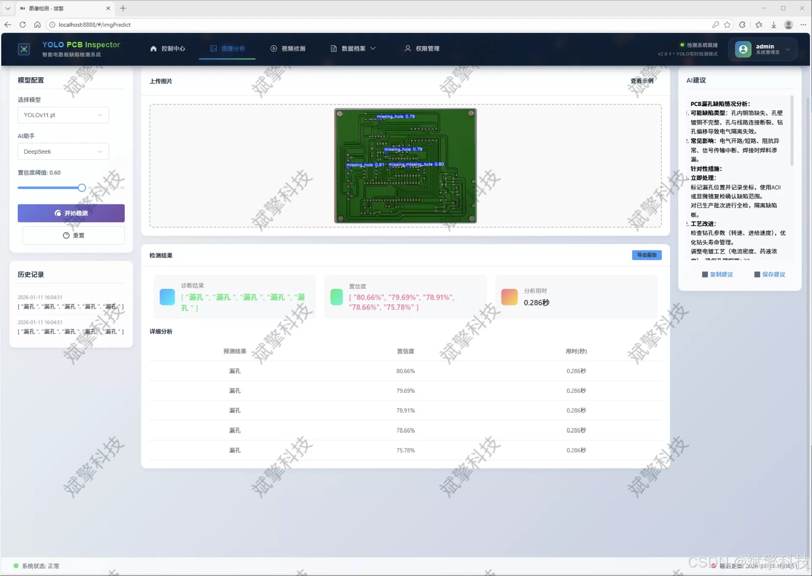
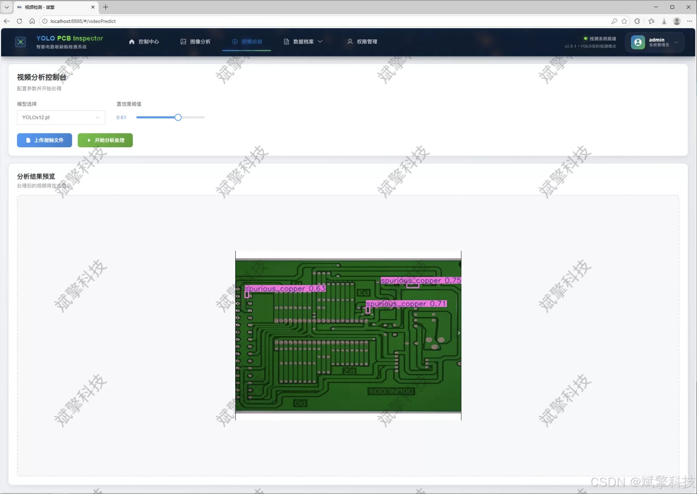
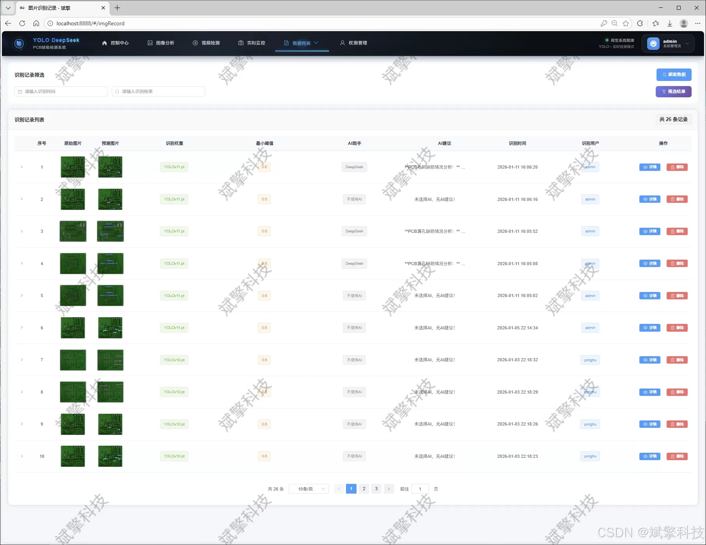
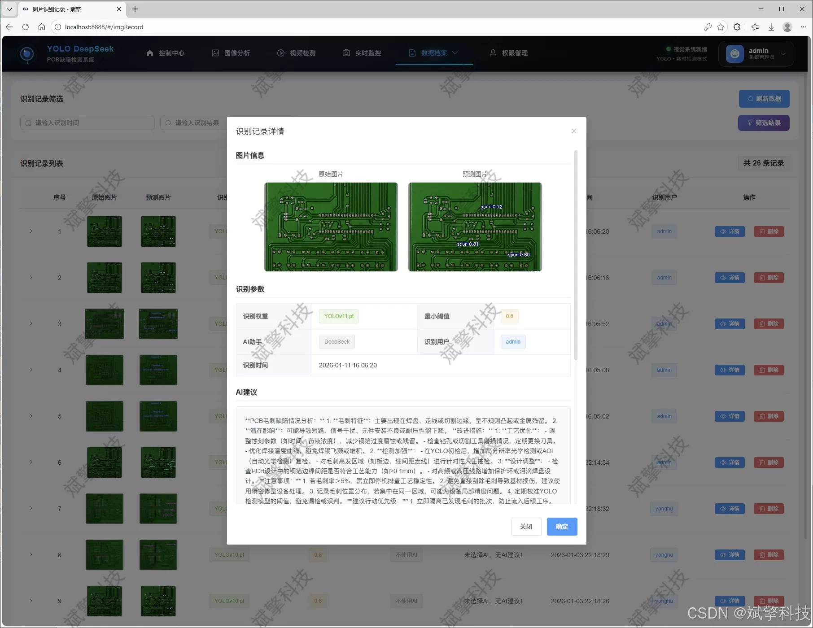
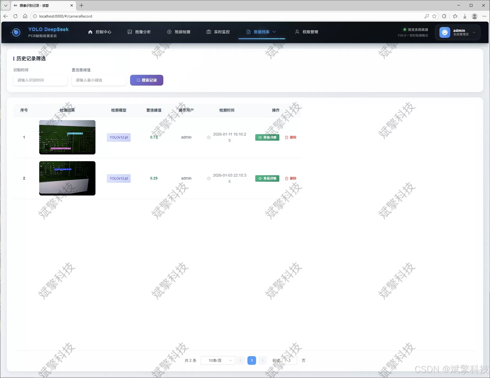
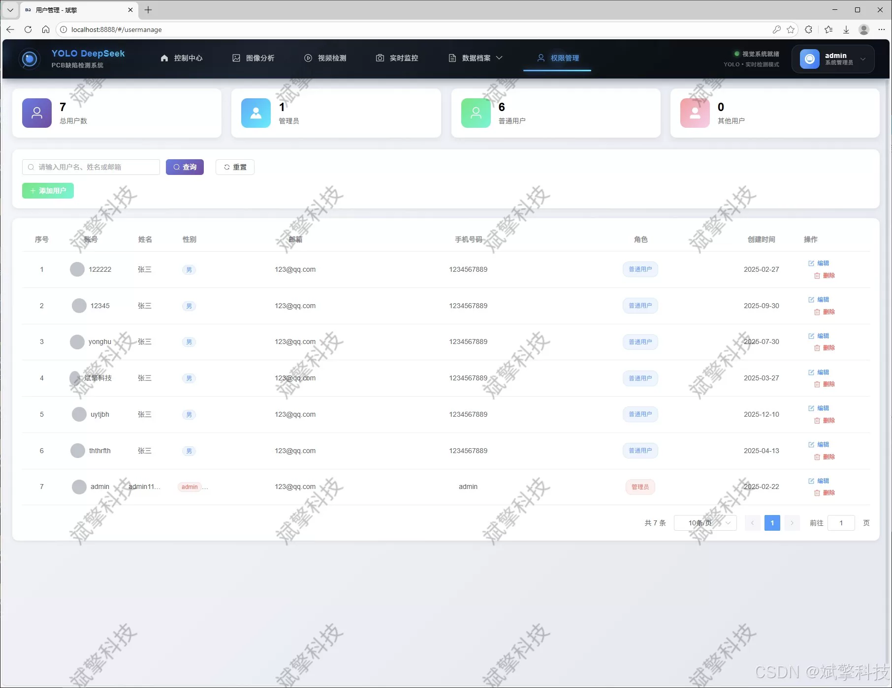

# Based on YOLO deep learning and the large models of Qianwen and DeepSeek, the PCB design

## Body

Based on the YOLO deep learning and the big models of Qianwen, DeepSeek PCB defect detection system (DeepSeek intelligent analysis + web interface + front-end separation + YOLO data + YOLOv8/YOLOv10/YOLOv11/YOLOv12)

This study designs and implements an intelligent PCB defect detection system based on the latest YOLO series algorithms (including YOLOv8, YOLOv10, YOLOv11, YOLOv12) and SpringBoot full-stack framework. The system adopts a modern architecture with a front-end and back-end separation, the backend is built on SpringBoot to create RESTful APIs, and the front end provides an intuitive Web interface. The database uses MySQL for structured data persistence. The core functions of the system include: 1) Multi-model dynamic detection: integrates four advanced YOLO models, users can freely switch between different speed and precision needs to achieve precise recognition of six typical PCB defects (missing_hole, mouse_bite, open_circuit, short, spur, spurious_copper); 2) Multimodal input support: fully supports image upload, video files, and real-time streaming media defect detection, and both the detection results and original files are saved to the database, forming a complete traceable record; 3) DeepSeek intelligent analysis enhancement: based on the detection results, integrates the intelligent analysis capability of the large language model of DeepSeek, conducts cause analysis, maintenance suggestions, etc., textual descriptions of detected defects, greatly improving the system's interpretability and practicality; 4) Comprehensive data management and visualization: provides user management, detection record management (images, videos, real-time), and other functional modules, and visualizes detection data through charts and other forms to assist in production quality analysis. 5) Complete user system: includes user registration and login, personal center information maintenance, and administrator back-end management functions.

Functional modules

✅ User login registration: Support password verification, saved to MySQL database.

✅ Support switching among four YOLO models, YOLOv8, YOLOv10, YOLOv11, YOLOv12.

✅ Information visualization, data visualization.

✅ AI analysis function support for images detection, video detection, and camera real-time detection, detection results saved to MySQL database.

✅ Image detection record management, video detection record management, and camera recognition record management.

✅ User management module, administrators can add, delete, update, and manage users.

✅ Personal center, can modify their own information, password name profile picture and so on.

## Images

## Payment

Here is a pay link on Stripe ( https://buy.stripe.com/3cs8yP7sY87d0vu9AB ). Please contact me lonlonago@foxmail.com after funding $89, and I will send you a complete data files , thank you!

